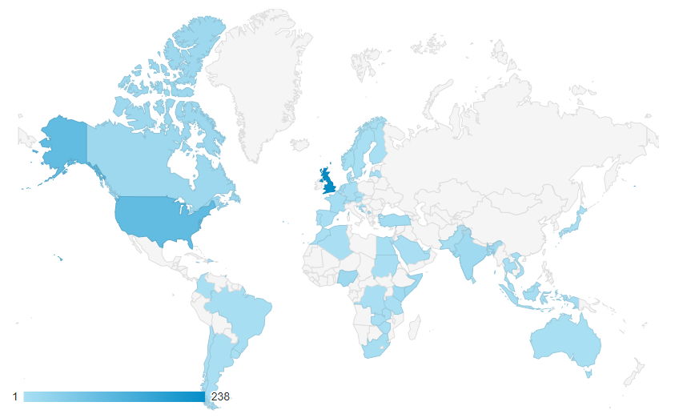
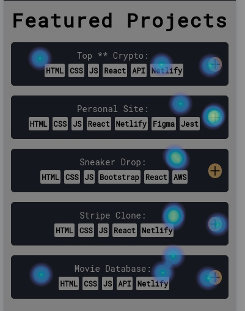

<!-- PROJECT LOGO -->

 

  

  <h3 align="center">Personal Portfolio</h3>

  

    A site which demonstrates my software development skills and showcases my projects
     
     
    <a href="https://top100cryptocurrencies.netlify.app/" target='#'>View Demo</a>
    ·
    <a href="https://github.com/Samatarx/Personal-Portfolio/issues">Report Bug</a>
    ·
    <a href="https://github.com/Samatarx/Personal-Portfolio/issues">Request Feature</a>
  

<!-- TABLE OF CONTENTS -->

## Table of Contents

1. [About the Project](#about-the-project)
2. [Built With](#built-with)
3. [Features](#features)
4. [React](#react)
5. [Figma](#figma)
6. [SEO](#seo)
7. [Future Work](#future-work)
8. [Contact](#contact)
9. [Acknowledgements](#acknowledgements)

<!-- ABOUT THE PROJECT -->

## About The Project

I created a my portfolio to demonstrate my ability to create stunning sites and to also showcase my previous work. Before starting the site I created a simple wireframe so that I could put my designing skills to the test.

I learnt how to use several new animation libraries to bring my vision to life. Furthermore, I implemented a Netlify form for the first time, was able to make the site accessible and responsive to all screen sizes.

### Built With

- [React JS](https://reactjs.org/)
- [Figma](https://figma.com)
- HTML/CSS/JS

<!-- USAGE EXAMPLES -->

## Features

- Landing page with particle animations and text transitions
- Functional about me section
- Customisable colour themes
- Contact form which utilises Netlify forms
- Project list with swipeable scrolling
- Responsive to all screen sizes

<!-- ROADMAP -->

## React

- Implemented the use of React hooks throughout the project
- Utilised useEffect to close the navigation automatically after 15 seconds
- Was able to reduce the size of components by mapping through data exported from an addtional JS file
- Leveraged external libraries to create the form and animation effects for the site
- Used useRef to navigate through the site seemlessly

<!-- Future Improvements -->
## Figma

Made a low fidelity wire frame on Figma to visualise the ideas I had for my website.

[Figma Link](https://www.figma.com/file/2xkXhjaSkSbtAKJHFeEyYb/Portfolio?node-id=0%3A1)

  

## SEO

Was able to obtain the highest score for the Google Lighthouse report, gaining an average of 100 for all categories on desktop.

  

## Google Analytics

I added Google Analytics to my website to track where visitors to my site were coming from. Over the space of one month, my site has attracted over 500 unique visitors from all over the world and on every continent. Additionally, I am also able to monitor how much time a visitor spends on my site.

  

## Hotjar

I used Hotjar to monitor where users on my website were clicking.

  

## Future work

- Add a blog section to my site

<!-- CONTACT -->

## Contact

Project Link: [samatar.co](https://samatar.co)

<!-- ACKNOWLEDGEMENTS -->

## Acknowledgements

- [Swiper JS](https://swiperjs.com/)
- [React Spring](https://react-spring.io/)
- [Particle JS](https://github.com/VincentGarreau/particles.js/)
- [UUID](https://www.npmjs.com/package/uuid)
- [React-Interval](https://www.npmjs.com/package/react-interval)
